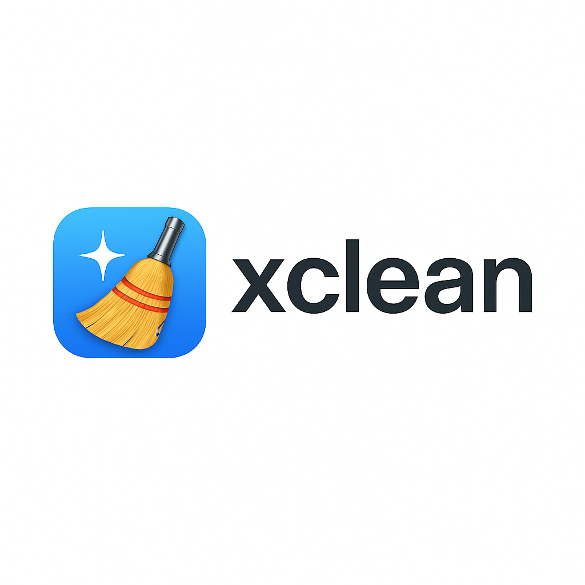

# Xclean

> Clean up your Xcode workspace, simulators, runtimes, and more — with style.


---

## Features

- 🯄 **Clean** DerivedData, Archives, SwiftPM Cache *(Coming Soon 🚀)*
- 📱 **List simulators** with storage usage
- 📈 **Highlight critical simulators** (above 3GB or your threshold)
- 🧹 **List and remove runtimes**
- 🭹 **Interactive cleanup** of large simulators
- 🎝 **Dry-run**, **Force Clean**, **Summary-only** modes
- 📋 **Save reports** to file with `--output`
- 💻 **Built for macOS** – supports Intel & Apple Silicon
- 🎨 **Beautiful CLI** with emojis, colors, and spinners

---

## Installation

```bash
git clone https://github.com/yourname/xclean.git
cd xclean
make build-mac
./bin/xclean_darwin_arm64 list sims
```

---

## CLI Usage Examples

```bash
xclean list sims                          # List all simulators above 3GB
xclean list sims --threshold 2            # List simulators larger than 2GB
xclean list sims --summary-only           # Only print total space and counts
xclean list sims --output report.txt      # Save full report to file
xclean list sims --clean                  # Interactively delete large sims
xclean list sims --clean --dry-run        # Simulate what would be cleaned
xclean list sims --clean --force-clean    # Delete without confirmation
xclean list runtimes                      # List installed Xcode runtimes
xclean remove runtime "iOS 17.5"          # Remove a specific runtime
xclean remove runtime "iOS 17.5" --force  # Force remove runtime without asking
```

---

## Screenshot

> Professional terminal output with emoji indicators, colors, and spinner animations.

<!--  -->

---

## Roadmap

- ⚡ Add `clean` command for DerivedData, Archives, SwiftPM
- ⚙️ Auto-detect extremely large sims (>10GB) as "Severe" (🔥)
- 📦 Homebrew tap install (`brew install xclean`)
- 🖥️ Export JSON or Markdown reports

---

## License

MIT © [Apptitude Labs](https://github.com/ApptitudeLabs)

