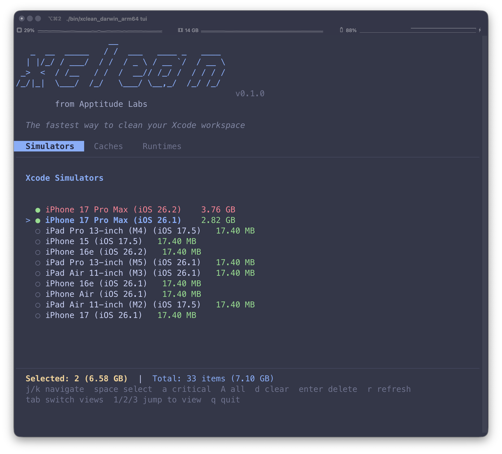

# Xclean

> Clean up your Xcode workspace, simulators, runtimes, and more — with style.

---

## Features

- 🖥️ **Interactive TUI** — Beautiful terminal UI with tabs for Simulators, Caches, and Runtimes
- 🧹 **Clean** DerivedData, Archives, ModuleCache, SwiftPM Cache
- 📱 **List simulators** with storage usage
- 📈 **Highlight critical simulators** (above 3GB or your threshold)
- 🧹 **List and remove runtimes**
- 🔄 **Interactive cleanup** of large simulators
- ⚡ **Dry-run**, **Force Clean**, **Summary-only** modes
- 📋 **Save reports** to file with `--output`
- 💻 **Built for macOS** – supports Intel & Apple Silicon
- 🎨 **Beautiful interface** with Catppuccin theme, colors, and spinners

---

## Installation

```bash
git clone https://github.com/ApptitudeLabs/xclean.git
cd xclean
make build-mac
./bin/xclean_darwin_arm64              # Launch interactive TUI
./bin/xclean_darwin_arm64 --cli help   # Use CLI mode
```

---

## Usage

### Interactive TUI (Default)

Simply run `xclean` to launch the interactive terminal UI:

```bash
xclean
```

**Keyboard shortcuts:**
| Key | Action |
|-----|--------|
| `Tab` | Switch to next view |
| `Shift+Tab` | Switch to previous view |
| `1` / `2` / `3` | Jump to Simulators / Caches / Runtimes |
| `↑` / `↓` | Navigate list |
| `Enter` | Select / Confirm |
| `d` | Delete selected item |
| `q` | Quit |

---

## CLI Usage Examples

Use the `--cli` flag to access the traditional command-line interface:

```bash
# Clean Xcode caches
xclean --cli clean                              # Clean DerivedData, Archives, ModuleCache, SwiftPM
xclean --cli clean --dry-run                    # Preview what would be deleted

# List and manage simulators
xclean --cli list sims                          # List simulators with storage usage
xclean --cli list sims --threshold 2            # Only show simulators larger than 2GB
xclean --cli list sims --summary-only           # Only print total space and counts
xclean --cli list sims --output report.txt      # Save full report to file
xclean --cli list sims --clean                  # Interactively delete large sims (>3GB)
xclean --cli list sims --clean --dry-run        # Simulate what would be cleaned
xclean --cli list sims --clean --force-clean    # Delete without confirmation
xclean --cli cleansims                          # Delete all sims over 2GB (with confirmation)
xclean --cli cleansims --dry-run                # Preview what would be deleted
xclean --cli cleansims --force                  # Delete without confirmation

# Manage runtimes
xclean --cli list runtimes                      # List installed Xcode runtimes
xclean --cli remove runtime "iOS 17.5"          # Remove a specific runtime
xclean --cli remove runtime "iOS 17.5" --force  # Force remove runtime without asking
```

---

## Screenshot

> Interactive TUI with tabbed navigation, Catppuccin theme, and real-time updates.



---

## Roadmap

- 📦 Homebrew tap install (`brew install xclean`)
- 🖥️ Export JSON or Markdown reports

---

## License

MIT © [Apptitude Labs](https://github.com/ApptitudeLabs)

